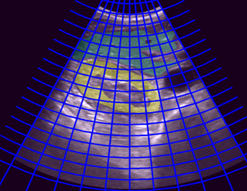
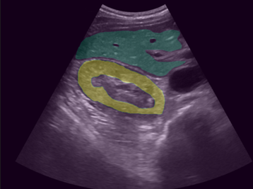
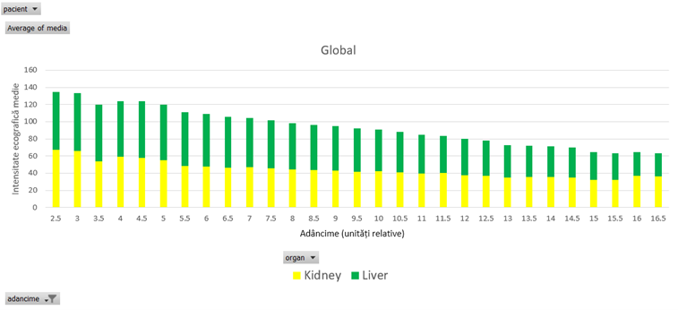

# Fatty Liver Ultrasound Analysis (Dissertation Project)

This project presents an **end-to-end data analysis pipeline** for extracting quantitative insights from ultrasound images, supporting **early detection of fatty liver disease**.

---

## Project Overview

Medical ultrasound interpretation is often subjective. This project addresses that by transforming **raw ultrasound images into structured data** and analyzing signal behavior objectively.

### Key Idea
**Ultrasound signal intensity decreases with depth — quantified and validated using data analysis techniques.**

---

## Visual Results

### Ultrasound with Grid Overlay
Custom deformable grid adapted to ultrasound geometry, enabling region-based analysis.  

### Segmentation Example
Annotated regions highlighting liver and kidney areas used for analysis.  

### Intensity vs Depth Analysis
Clear decreasing trend of signal intensity as depth increases.  

---

## Project Implementation

- Designed a **custom deformable grid (mesh)** adapted to ultrasound geometry  
- Converted medical images (**DICOM → NIFTI**)  
- Performed **image preprocessing** (Gaussian blur, Canny edge detection, Hough transform)  
- Extracted features from thousands of image regions  
- Applied **Gaussian Mixture Models (GMM)** to model pixel intensity distributions  
- Computed **vertical intensity gradients** between regions  
- Aggregated results into structured datasets for analysis  

---

## Data & Scale

- 200 ultrasound images  
- 80 patients  
- ~80,000 data records (cell-level statistics)  
- ~110,000 comparisons (gradient analysis)  
- Final aggregated dataset (~3,000 rows)

---

## Key Result

A clear and consistent trend was identified:

- **Signal intensity decreases progressively with depth**  
- Valid across both liver and kidney regions  

This confirms the working hypothesis and enables **objective evaluation of ultrasound data**.  

---

## Tools & Technologies

- **Python**  
- **NumPy / Pandas**  
- **Jupyter Notebook**  
- **ITK-SNAP**  
- **OpenCV**  
- **Excel**

---

## My Contribution

- Designed and implemented the **grid-based analysis system**  
- Built the **full data processing pipeline**  
- Performed **statistical analysis and interpretation**  
- Transformed **unstructured image data into structured datasets**

---

## Repository Contents

- `fatty_liver_dissertation_presentation.pdf` – Dissertation presentation slides  
- `/images` – Visual examples of processing and results  

---

## Note on Data & Code

Due to medical data confidentiality, raw datasets and full implementation are not publicly available.  
This repository focuses on **methodology, data processing, and analytical approach**.

---

## Why This Project Matters

- Reduces subjectivity in medical imaging  
- Enables **data-driven diagnosis support**  
